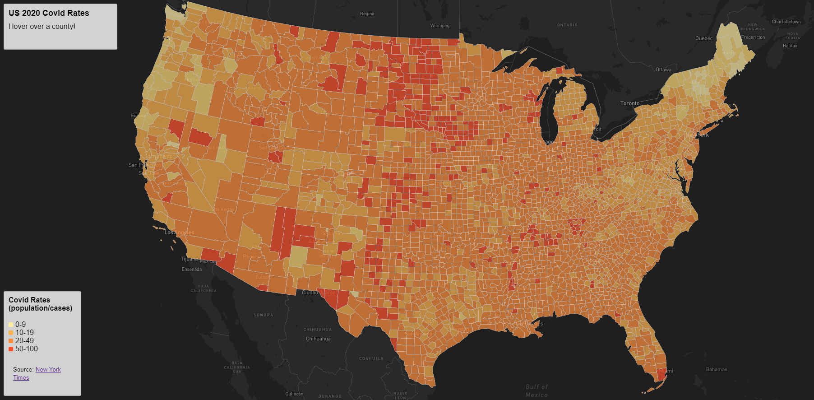

# geog458_lab3: Covid Web Mapping

## Introduction
This project uses MapBox JS to make a choropleth web map application showing covid rates by county and a proportional symbol web map application showing covid count by county. The covid counts were pulled from the [New York Times](https://github.com/nytimes/covid-19-data/blob/43d32dde2f87bd4dafbb7d23f5d9e878124018b8/live/us-counties.csv) and population data was pulled from the  [ACS 5 Year 2018 estimates](https://data.census.gov/cedsci/table?g=0100000US.050000&d=ACS%205-Year%20Estimates%20Data%20Profiles&tid=ACSDP5Y2018.DP05&hidePreview=true). County shapefiles were pulled from the [US Census Bureau](https://www.census.gov/geographies/mapping-files/time-series/geo/carto-boundary-file.html). All guides used to create the web maps can be found on [Professor Zhao's GEOG 458 github repository](https://github.com/jakobzhao/geog495/tree/main/labs/lab03).

## Map 1: Choropleth Map of Covid Rates

> [Use the map here.](https://loganweidner.github.io/GEOG458_Covid_Web_Mapping/map_1.html)

This is a map that allows the user to get a general idea of US covid rates, as well as use their mouse to hover over specific areas to learn the exact covid rate of said area. The description in the top left corner tells the user to hover over a county, and then replaces that text with the county information when the user is hovering over a county.

Please note that the Map Box projection functions are not working for this map, so it is currently in the default mapbox projection (Mercator) instead of the preferred Albers projection.

## Map 2: Proportional Symbol Map of Covid Cases

> [Use the map here.](https://loganweidner.github.io/GEOG458_Covid_Web_Mapping/map_1.html)

This is a map that allows the user to see where the most covid cases were being recorded in 2020. The description box tells the user to click on a symbol to view the specific information on that county. When the symbol is clicked, a box will pop up that shows the user the name of the county, states, and recorded covid cases.